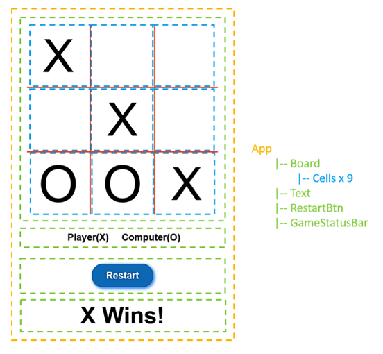

# Workshop: Migrate to Typescript

This walkthrough illustrates how to adopt TypeScript in an existing React/Babel/Webpack project. We'll start with a TicTacToe project written fully in JavaScript. By the end, you will have a TicTacToe project fully written with TypeScript.

Adopting TypeScript in any project can be broken down into 2 phases,
 * Adding TypeScript compiler (tsc) to your build pipeline.
 * Converting JavaScript files into TypeScript files.

# Understand the existing JavaScript project

Before we dive into TypeScript adoption, let's take a look at the structure of the TicTacToe app. It contains a few components and looks like below with or without TypeScript.

<p align="center">
  
</p>

As shown in `package.json`, the app already includes React/ReactDOM, Webpack as bundler & npm/yarn as task runner, and [babel-loader](https://github.com/babel/babel-loader) Webpack plugin to use Babel for ES6 and JSX transpilation. The project has the below overall layout before we adopt TypeScript:

```
workshop-migrate-to-typescript/
  |-- src/
    |-- index.html      // web page for our app
    |-- main.jsx        // app boot and initialization logic
    |-- style.css       // app css
    |-- app/			      // app source files
      |-- constants.js	    // some shared constants
      |-- App.jsx		        // the root App React component
      |-- Board.jsx		      // the TicTacToe Board React component
      |-- Cell.jsx		      // the TicTacToe Cell React component
      |-- GameStateBar.jsx	// GameStatusBar React component
      |-- RestartBtn.jsx	  // RestartBtn React component
  |-- .babelrc		       // a list of babel presets
  |-- package.json		   // node package configuration file
  |-- webpack.config.js	 // Webpack configuration file
```

# Add TypeScript compiler to build pipeline

## Install dependencies

First off, open terminal and install dependencies in `package.json`.

```sh
npm install
#or
 yarn install
```

Additionally, install TypeScript (2.4 or higher), [awesome-typescript-loader](https://www.npmjs.com/package/awesome-typescript-loader) and [source-map-loader](https://www.npmjs.com/package/source-map-loader) as dev dependencies if you haven't. awesome-typescript-loader is a Webpack plugin that helps you compile TypeScript code to JavaScript, much like babel-loader for Babel. There are also other alternative loaders for TypeScript, such as [ts-loader](https://github.com/TypeStrong/ts-loader). source-map-loader adds source map support for debugging.

```sh
yarn add --dev typescript@2.4.0 awesome-typescript-loader source-map-loader
# or
npm install --save-dev typescript@2.4.0 awesome-typescript-loader source-map-loader
```

Get the type declaration files (.d.ts files) from [@types](https://blogs.msdn.microsoft.com/typescript/2016/06/15/the-future-of-declaration-files/) for any library in use. For this project, we have React and ReactDOM.

```sh
yarn add --dev @types/react @types/react-dom
# OR
npm install --save-dev @types/react @types/react-dom
```

## Configure TypeScript

Next, configure TypeScript by creating a `tsconfig.json` file via `yarn tsc init`.

Now allow following options:

```
{
  "compilerOptions": {
    "outDir": "./dist/",        // path to output directory
    "sourceMap": true,          // allow sourcemap support
    "strictNullChecks": true,   // enable strict null checks as a best practice
    "module": "es2015",         // specifiy module code generation
    "target": "es5",            // specify ECMAScript target version
    "jsx": "react",             // use typescript to transpile jsx to js
    "allowJs": true             // allow a partial TypeScript and JavaScript codebase
  },
  "include": [
    "./src/"
  ]
}
```

You can edit some of the options or add more based on your own need. See more full [compiler options](https://www.typescriptlang.org/docs/handbook/compiler-options.html).

## Set up build pipeline

To add TypeScript compilation as part of our build process, you need to modify the Webpack config file `webpack.config.js`. This section is specific to Webpack. However, if you are using a different task runner (e.g. Gulp) for your React/Babel project, the idea is the same - replace the Babel build step with TypeScript, as TypeScript also offers transpiling to lower ECMAScript versions and JSX transpilation with a shorter build time in most cases. If you wish, you can also keep Babel by adding a TypeScript build step before Babel and feeding its output to Babel.

Generally, we need to change `webpack.config.js` in a few ways,

1. Expand the module resolution extensions to include `.ts` and `.tsx` files.
2. Replace `babel-loader` with `awesome-typescript-loader`.
3. Add source-map support.

Let's modify `webpack.config.js` as below,

```diff
const config = env => {
  return {
    // change to .tsx if necessary
    entry: resolve(PATHS.root, 'main.jsx'),
    output: {
      filename: 'bundle.js',
      path: PATHS.dist,
    },
    resolve: {
+      extensions: ['.ts', '.tsx', '.js', '.jsx']
-      extensions: ['.js', '.jsx']
    },
    devtool: 'source-map',
    devServer: {
      stats: 'minimal',
      overlay: true,
    },
    module: {
      rules: [
+       // addition - add source-map support
+       { enforce: "pre", test: /\.js$/, loader: "source-map-loader" }
        // js
+       { test: /\.(t|j)sx?$/, use: { loader: 'awesome-typescript-loader' } },
-       { test: /\.jsx?$/, include: /src/, use: { loader: 'babel-loader' } },
        // css
        { test: /\.css$/, include: /src/, use: ['style-loader', 'css-loader'] },
      ],
    },
    externals: {
      react: 'React',
      'react-dom': 'ReactDOM',
    },
    plugins: [
      new webpack.optimize.ModuleConcatenationPlugin(),
      new ProgressBarPlugin(),
      new HtmlWebpackPlugin({
        template: resolve(PATHS.root, 'index.html'),
      }),
    ],
  }
}
```


You can delete `.babelrc` and all Babel dependencies from `package.json` if you no longer need them.

Note that if you plan to adopt TypeScript in the entry file, you should change **entry**:

```diff
+entry: resolve(PATHS.root, 'main.jsx'),
-entry: resolve(PATHS.root, 'main.tsx'),
```

as well. For the time being, we will keep it as `main.jsx`.

You now have the build pipeline correctly set up with TypeScript handling the transpilation. Try bundling the app with the following command and then open `localhost:8080` in a browser,

```sh
npm start
# OR
yarn start
```

# Transition from JS(X) to TS(X)

In this part, we will walk through the following steps progressively,

1. The minimum steps of converting one module to TypeScript.
2. Adding types in one module to get richer type checking.
3. Fully adopting TypeScript in the entire codebase.

While you get the most out of TypeScript by fully adopting it across your codebase, understanding each of the three steps comes in handy as you decide what to do in case you have certain part of your JavaScript codebase you want to leave as-is (think legacy code that no one understands).

## Minimum transition steps

Let's look at `GameStateBar.jsx` as an example.

Step one is to rename `GameStateBar.jsx` to `GameStateBar.tsx`. If you are using any editor with TypeScript support such as [Visual Studio Code](https://code.visualstudio.com/), you should be able to see a few complaints from your editor.

On line 1 `import React from "react";`, change the import statement to `import * as React from "react"`. This is because while importing a CommonJS module, Babel assumes `modules.export` as default export, while TypeScript does not.

> We wanna introduce minimal changes, so Typescript allows us to mitigate this issue via [`allowSyntheticDefaultImports: true`](https://www.typescriptlang.org/docs/handbook/compiler-options.html) in your `tsconfig.json`

On line 3 `export class GameStateBar extends React.Component {`, change the class declaration to `export class GameStateBar extends React.Component<any, any> {`. The type declaration of `React.Component` uses [generic types](https://www.typescriptlang.org/docs/handbook/generics.html) and requires providing the types for the property and state object for the component. The use of `any` allows us to pass in any value as the property or state object, which is not useful in terms of type checking but suffices as minimum effort to appease the compiler.

By now, *awesome-typescript-loader* should be able to successfully compile this TypeScript component to JavaScript. Again, try bundling the app with the following command and then open `localhost:8080` in a browser,

```sh
npm start
# OR
yarn start
```

## Add types

The more type information provided to TypeScript, the more powerful its type checking is. As a best practice, we recommend providing types for all declarations. We will again use the `GameStateBar` component as an example.

For any `React.Component`, we should properly define the types of the property and state object. The `GameStateBar` component has no properties, therefore we can use `{}` as type.

The state object contains only one property `gameState` which shows the game status (either nothing, someone wins, or draw). Given `gameState` can only have certain known string literal values, let's use [string literal type](https://www.typescriptlang.org/docs/handbook/advanced-types.html) and define the `type` alias as follow before the class declaration.

```ts
type GameStateBarState = {
  gameState: '' | 'X Wins!' | 'O Wins!' | 'Draw';
}
```

With the defined type alias, change the `GameStateBar` class declaration,

```ts
export class GameStateBar extends React.Component<{}, GameStateBarState> {...}
```

Now, supply type information for its members.

> Note that providing types to all declarations is not required, but recommended for better type coverage.

```ts
// add types for params
constructor(props: {}) {...}
handleGameStateChange(e: CustomEvent) {...}
handleRestart(e: Event) {...}

// add types in arrow functions
componentDidMount() {
  window.addEventListener('gameStateChange', (e: CustomEvent) => this.handleGameStateChange(e));
  window.addEventListener('restart', (e: CustomEvent) => this.handleRestart(e));
}

// add types in arrow functions
componentWillUnmount() {
  window.removeEventListener('gameStateChange', (e: CustomEvent) => this.handleGameStateChange(e));
  window.removeEventListener('restart', (e: CustomEvent) => this.handleRestart(e));
}
```

To use stricter type checking, you can also specify useful [compiler options](https://www.typescriptlang.org/docs/handbook/compiler-options.html) in `tsconfig.json`. For example, `strict` is a recommended option for, yes you guess it, strict type checking, which consist of various rules:

- noImplicitAny
- noImplicitThis
- alwaysStrict
- strictNullChecks

You can also add [private/protected modifier](https://www.typescriptlang.org/docs/handbook/classes.html) to class members for access control. Let's mark `handleGameStateChange` and `handleRestart` as `private` as they are internal to `gameStateBar`.

> NOTE: if you'll ever try to use protected or abstract in Typescript, beware your old alter OOP Java,C# is comming and may lead to destruction and oblivion

```ts
private handleGameStateChange(e: CustomEvent) {...}
private handleRestart(e: Event) {...}
```

Again, try bundling the app with the following command and then open `localhost:8080` in a browser,

```sh
npm start
# OR
yarn start
```

## Adopt TypeScript in the entire codebase

Adopting TypeScript in the entire codebase is more or less repeating the previous two steps for all js(x) files. You may need to make changes additional to what is mentioned above while converting perfectly valid JavaScript to TypeScript. However the TypeScript compiler and your editor (if it has TypeScript support) should give you useful tips and error messages. For instance, parameters can be optional in JavaScript, but in TypeScript all [optional parameter](https://www.typescriptlang.org/docs/handbook/functions.html) must be marked with `?`

